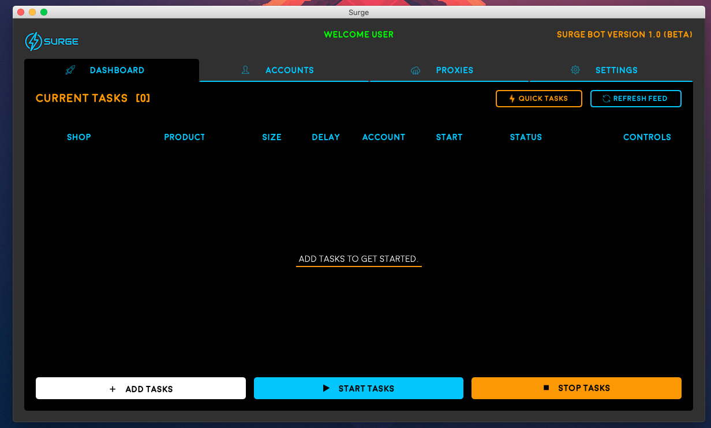
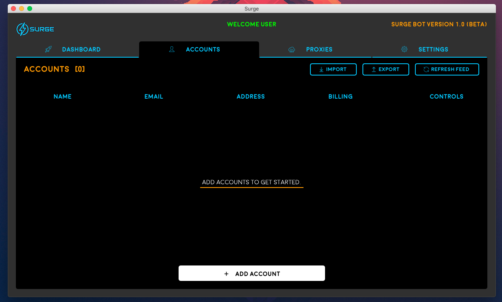
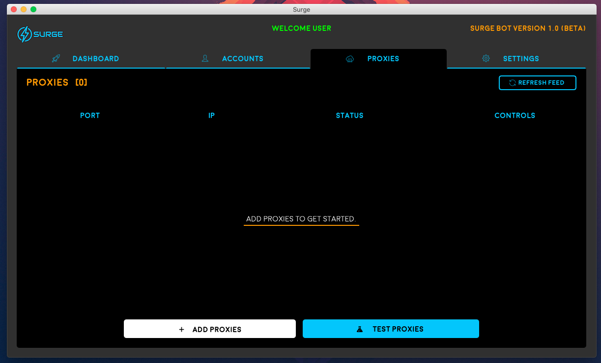
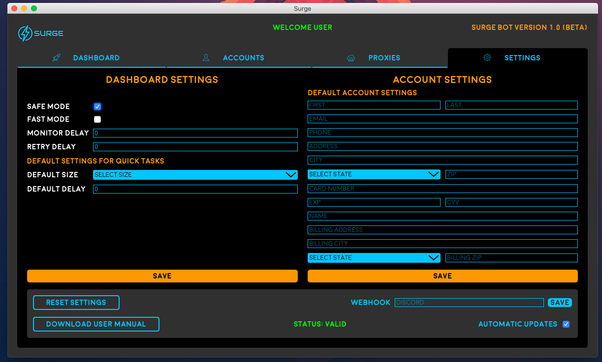

# SURGE

What's up chefs!

Alright, so here is the open-source version of SurgeBot...there are a lot of things that have to be covered before you go off and use this, so PLEASE read through this.

Also, this is developed for a Mac, but support for Windows will come soon. It will still work on Windows but the UI will look different.

# Setup

First of all, in order to get this for yourself, you have to clone this repository to your own computer and of course your own Python environment. This means that you need Python installed in your computer as well as a Python interpreter (I use Pycharm). That info can be easily found in youtube, so please check that out before cloning.

Once that is set up, go on window.py and click 'Run'. The main window should open up and you should see the dashboard page. If this isn't the case, please contact me (email is at the bottom). 

Ok, so now I will go through exactly what you need to know in order to use this for your own use.

As you can see, there are 4 main tabs: Dashboard, Accounts, Proxies, and Settings. Below, I will outline each tab individually so you can get the most optimal experience.

# Dashboard Tab

This tab is for controlling, creating, and managing tasks. At first, it will show no tasks, since none have been added. In order to add tasks, simply click 'Add Tasks' on the bottom. This will open a window that gives you a number of input options. For now, the only store we support is Supreme, but that should change soon. Anyways, you select the store, then for the product you MUST enter keywords in the form of +keyword +keyword -keyword. The keywords should each have a space between them, and you must use positive and negative signs to indicate positive and negative keywords. Then, you can select a size depending on the type of product (select 'Random' if it is an accessory or if you don't care about size). You can set a checkout delay which will wait to submit the order until the delay passes. You can choose how to start the tasks, and for this there are two options: manual or at a time. Manual tasks wait for the start buttons to be click, and timed tasks wait until the time matches the current time before starting. Finally, you can select any number of tasks, which is 1-100. Keep in mind that the number of tasks you should run is largely dependant on your computer's processing power. When you add the tasks, nothing will happen until you click the 'Refresh' button at the top. This will then show a few more buttons. The 'Select All' button is used to gather all tasks, and once they are all checked, you can edit all or delete all. You can also use the edit and delete buttons with custom-checked tasks if you only want to perform those functions on certain tasks. 

Once your tasks have been added, you will see rows that correspond to your tasks. They display the given shop, product, size, delay, account, start, status, and controls for each task. The controls are important to understand. The left-most button is the start task button, and that will run only that specific task. It can be stopped after you click run. Next to that is the edit button, which lets you edit that specific task. Finally there is the delete button, which deletes that task and updates the UI. 

In order to run tasks, make sure that 1 of these 2 things are set: either you have the same number of accounts as you do tasks (see info about Accounts Tab) or you have to set a default account in the Settings Tab (see info about Settings Tab). Proxies are not fully necessary, but they are suggested. Same as the accounts, make sure the number of proxies is the same as the number of tasks. Info about this can be seen on the Proxies Tab below. If no proxies are set, then no proxy is configured for the tasks and your local IP is used. 

When you start tasks, you will notice a change in the status. This will update as it goes along on the website.

# Accounts Tab

The setup for this tab is pretty much the same as setting up tasks. You just click 'Add Accounts' on the bottom to add an account, or you can import or export a CSV file (info below). The same buttons from the Dashboard Tab apply here, including the select all, edit, and delete buttons. To the right of the accounts you will see an edit button and a delete button; this will either edit or delete that specific account. Remember to click the refresh button once you add accounts so the UI can update.

# Proxies Tab

This tab is different than the first two, so stay with me. First, click the 'Add Proxies' tab at the bottom to add proxies. All you have to do is copy and paste them from your proxy provider in the usual format from your provider. Click refresh once they are added. You can select all and delete proxies. You can also test proxies, which is done by pressing the 'Test Proxies' button at the bottom. Give this some time, because it sometimes takes awhile to test proxy speed. If the proxies either don't load in time or are wrong, then the status will display Invalid. If everything goes well, then you will see the status as Valid with the time it took to load the website. Next to the rows of proxies are individual edit, test, and delete buttons, which are self-explanatory. 

# Settings Tab

This tab is pretty much your best friend if you want to go for something last-minute. For the default dashboard settings, you can set the mode you want to run your tasks (safe or fast), as well as the monitor delay and the retry delay. When making quick tasks, the size and delay will be taken from this page, so set them as what you want if you don't have time to go for something. Click 'Save' at the bottom if you make a change. Next to that is the default account settings, and this will be beneficial for testing or last-minute setups. The account information you enter here is used in a number of cases: if you have tasks but no accounts, then this account is assigned to each task so it still runs (NOT RECOMMENDED). If you, lets say, have 10 tasks but only 5 accounts, then the default account will be assigned to the last 5 tasks. Click 'Save' when changes are made. Below that is a group of other functions. The reset settings button will reset all settings to what it starts as. The download button below that, as of now, does nothing, but I am planning on changing that soon. The webhook input is for you to put your Discord handle. When you cop something, our Discord will get a notification about your success. The automatic updates checkbox also does nothing as of now. The bottom should show the status as Valid if everything is ok. If it doesn't, contact me at my email at the bottom. 

# Best Practices

Ok, so now that you've made it this far, here are some of my tips for maximizing your experience. First of all, I would set your settings up ASAP. Then, go on to make your tasks, accounts, and proxies. In order to import and export accounts, please make an account first then export it to see it's format. For running tasks, I prefer to set the monitor and retry delays to 2500, but the option is yours. Please experiment with other values so we know what works best. When running a task at a specified time, make sure to start it a minute before it drops (Supreme drops are at 11am EST, so start them at 10:59am). This ensures that the bot can have time to refresh the page to search for the product and click it as soon as it sees it. 

If you are interested in packaging this into an executable file or an app, check out auto-py-to-exe on GitHub and it will cover everything you need. You can find that <a href="https://github.com/brentvollebregt/auto-py-to-exe">here</a>.

Thank you for taking the time to read this, and best of luck! If you feel like you can contribute to this project, feel free to make pull requests. If you have any ideas or suggestions, email me. Lets cook!

For help, support, or questions email me at evanbrooks0629@gmail.com
